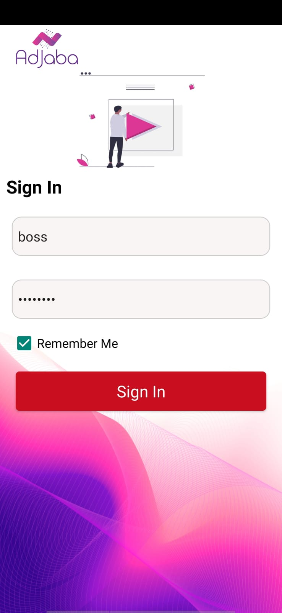
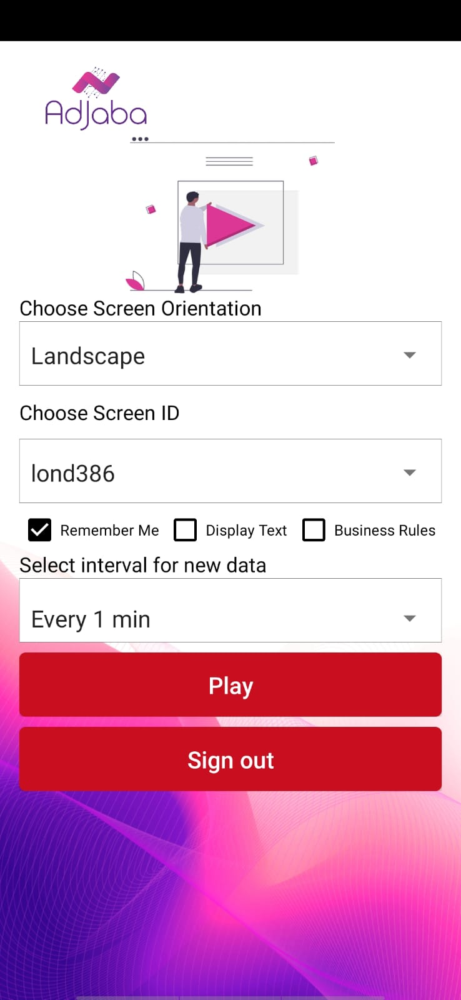

# 📷 Adjaba Player App

An Android application built with **Java** using **Android Studio**.  
This app provides a simple flow with select screen, login screen, and Preview Ads Screen.

---

## 🚀 How to Build and Run App

1. Clone the repository:
   ```bash
   git clone https://github.com/coenq/onlycamera.git
2. Open the project in Android Studio.
3. Make sure you have installed:
   Android Studio (latest version recommended).
   JDK 11 or higher.
   Android SDK (API +33).
4. Connect a device or start an emulator.
5. Run the app:
   Select your device from the Android Studio toolbar.
   Click ▶️ Run.
## 📱 Main Screens in the App

Login Screen
The screen where the user enters mail and password to log in.
(Class: LoginActivity.java)

Select Screen
The second screen where the user selects an option before proceeding.
(Class: SelectScreen.java)

Preview Ads Screen
The main feature of the app, allowing the user to view ads.
(Class: PreviewAds.java)
## 📸 Screenshots

### Login Screen


### Select Screen


### Preview Screen

